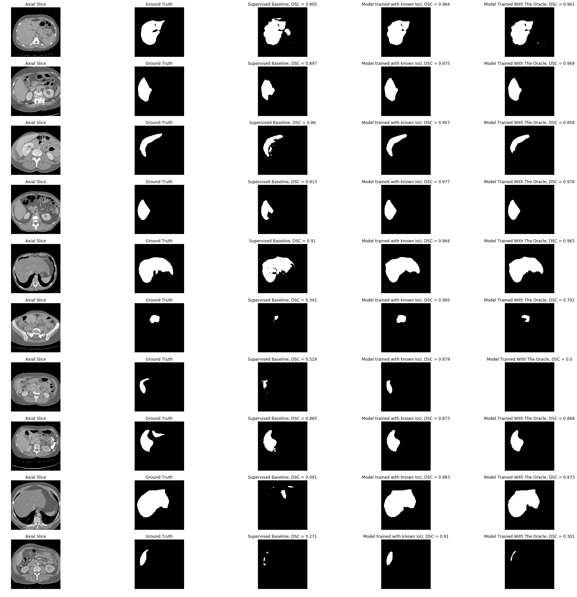
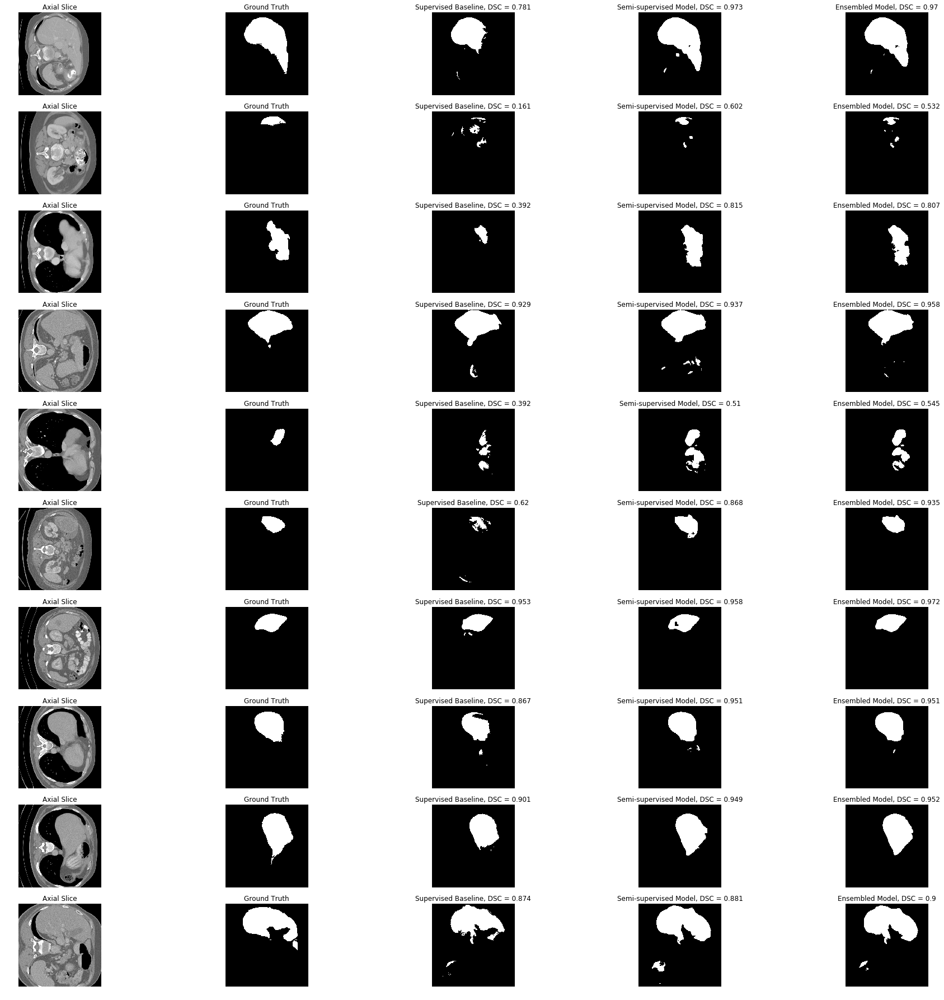

# Official Master Thesis

This repository includes the necessary implementation to reproduce the experiments highlighted in the master thesis.

## Necessary dependencies
* Python@2.7 - 3.6
* Tensorflow-gpu@1.5
* Keras
* numpy
* Nibabel
* Scipy
* dicom
* h5py

## Datasets
This example comprises the use of _D3-ircad_ database that includes 20 CT volumes for patients. 15 out of 20 scans feature tumors in the liver. All axial slices are represented in DICOM format. This repository contains the necessary utility to translate the downloaded database to a consumable .h5 database. 

Please consult the __ircad__ website to learn more:

* https://www.ircad.fr/research/3d-ircadb-01/

## Data Extraction

The provided code example assumes that the _D3-ircad_ is located in the project root repository. Steps to reproduce:

1- Download `3Dircadb1.zip` from the _ircad_ website and add it to the project root.

2- Execute the notebook `1- dircad-data-extractor.ipynb` to decompress and synthesize the data.

3- Execute the notebook `2- dataset-builder-dircad.ipynb` to build an `.h5` dataset that contains all volumes. 

## Self-Training

The thesis proposes a self-training method that enables semi-supervised learning on liver segmentation. The technique makes use of an oracle that learns to assess the quality of segmentation. A supervised model computes masks to unsupervised data. The oracle discerns the masks with high prediction and includes them in the training data. The following image highlights the training workflow:

### Training the Oracle
The first step consists of training an oracle using the annotated data (1 of the 20 labeled patients). Here is the following step in the provided example:

1- Execute the notebook `3- oracle-database-build.ipynb` to generate a training database for the oracle. We choose per default the CT scan `0` as the annotated data in the provided example.

2- Execute the notebook `4- training-oracle.ipynb` to train an oracle. The model is initialized with a pre-trained VGG-16 model on the ImageNet task (1000 categories). 

### Training the Segmenter
In the first iteration of the self-training, the segmenter is trained on the annotated dataset solely. The segmenter computes liver segments for unannotated data (19 remaining CT scans). Each computed segmentation is evaluated by the oracle. If the oracle assesses that a mask for a given axial slice is of high quality (class `0` or `5`), then the mask will be added in its corresponding bucket. A sampling process is carried out to select a few samples from each bucket. At each iteration, the sampling compels the increase of the database size, hence adding new data at each iteration. These steps can be executed as follows:

1- Execute the notebook `5- init-ssl-database.ipynb` to initialize a separate database that contains the semi-supervised data.

2- Execute the notebook `6- self-training.ipynb` to train the segmenter with the annotated data and samples new annotated data. Re-execute the notebook to iterate further with self-training method.

### Liver Segmentation

## Contact
For any type of query conserning this work, please contact the author per email: `ahmedrekik93@gmail.com`.